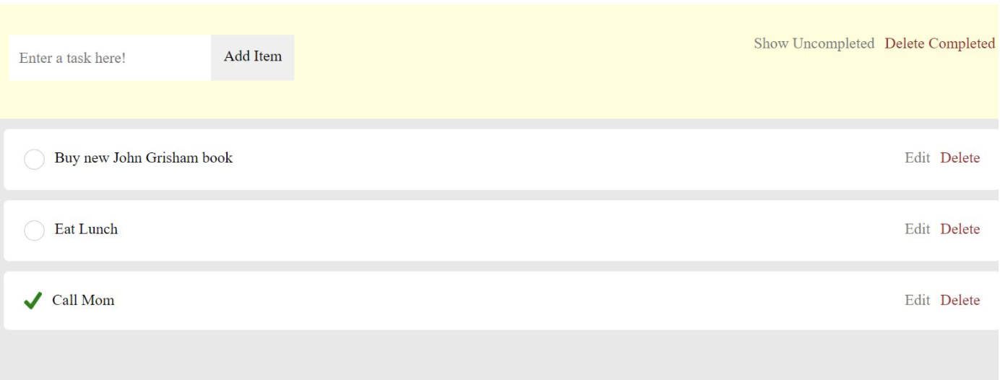
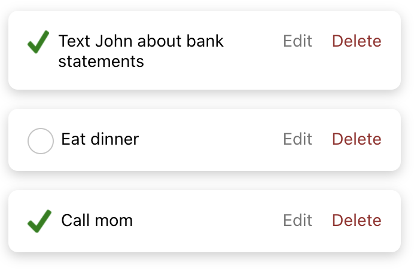
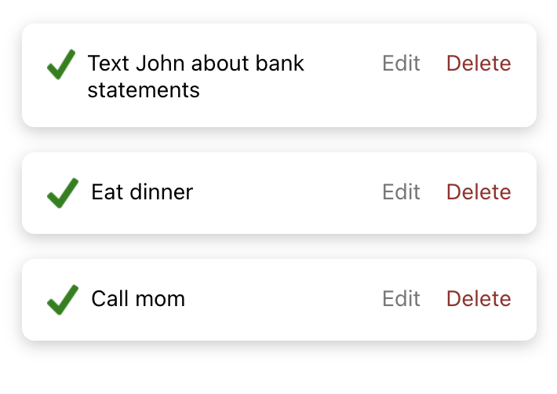
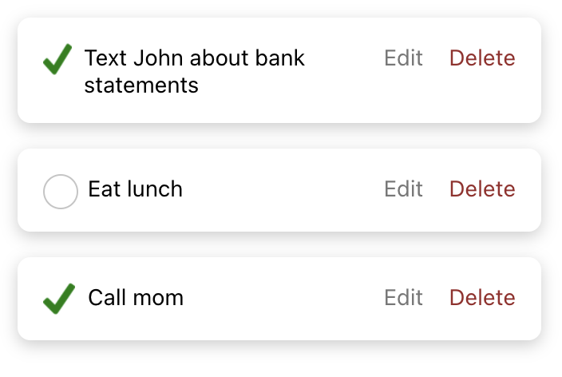
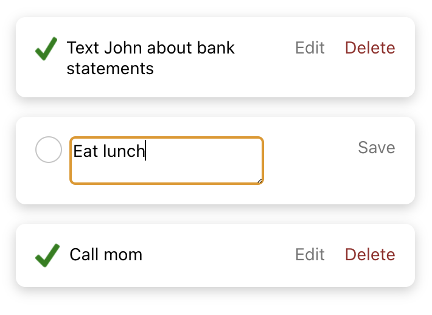
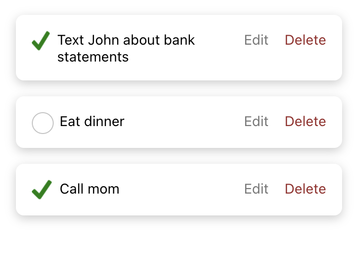
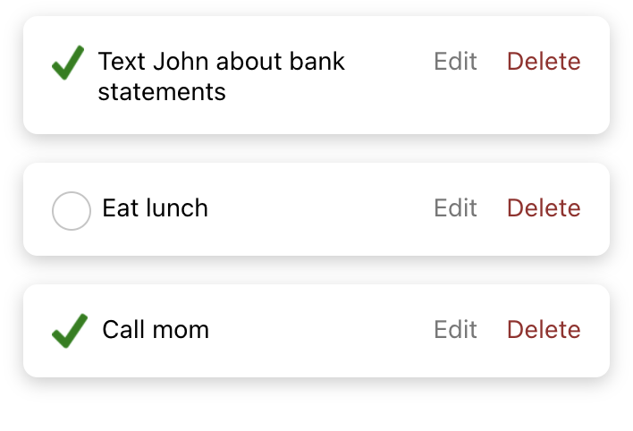
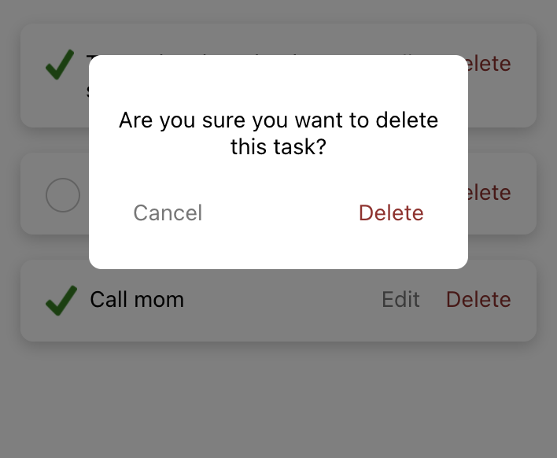
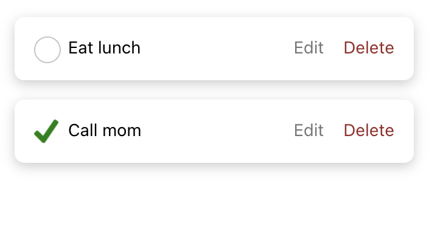

# CS124 Lab2 Design Document

## Design Decisions
To recap, our final design from Lab1 looked like this:

The key differences are as follows:
* Modal pop-ups to confirm delete requests
* Different font: the sans serif font in the newer design instead of the serif font
in the older design presents a more modern and user-friendly look
* Box shadow around each to-do task: the added shadow simulates elevated tasks, which
adds more emphasis without the grey background, which made the overall design seem a
bit flat 
* ...

## Alternative Designs
... none?

## User Testing
...

## Final Design
Our final design from this lab looks like this:

We will now walk through each of the supported features.

### Marking a task as completed/not completed
The user has a list of tasks -- some are completed, some are not.

The user clicks on the open circle within the second task to mark it as completed.

### Adding a new task
...

### Renaming a task
The user has a list of tasks and wants to rename the second. The user clicks on "Edit".

The user is autofocused on a text box where the original task name is the starting value.

The task text is edited to be something different, then the user clicks on "Save" to save changes.

After clicking save, the renamed task is what's displayed.

### Deleting a task
The user has a list of tasks and wants to delete the first one. The user clicks on "Delete".

A modal is displayed that asks the user to confirm or cancel their delete request. If cancel
is clicked, the modal will close with no changes to the list of tasks. However, the user does
want to delete and confirms this by clicking "Delete".

After the delete request is confirmed, the modal closes and the first task is removed from the
list of tasks.

### Showing all completed tasks
...

### Deleting all completed tasks
...

## Challenges + Reflections
Deciding on which level of the component hierarchy each of the state variables should live,
as well as managing these states was quite challenging, but overtime, we became familiarized
with what would work best -- particularly, the importance of having a "single source of truth"
with all the nested components in this application. 

Overall, we're very proud of the improvements we've made from the final product of Lab 1. The
features within this design are much more user-friendly. For instance, we noted in Lab 1 that 
we planned to implement some sort of modal or pop-up dialog to minimize the possibility of 
users accidentally deleted a task, and we successfully did so. Additionally, our end product of
this lab has a more aesthetic design. Specifically, the white background and sans serif font makes
the application appear less distracting and more clean and simple.
