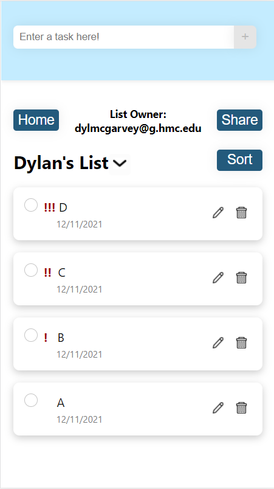
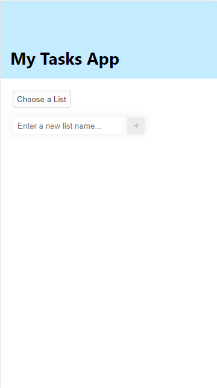
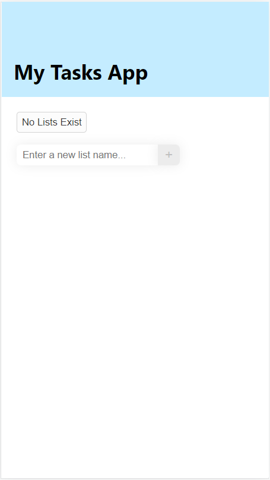
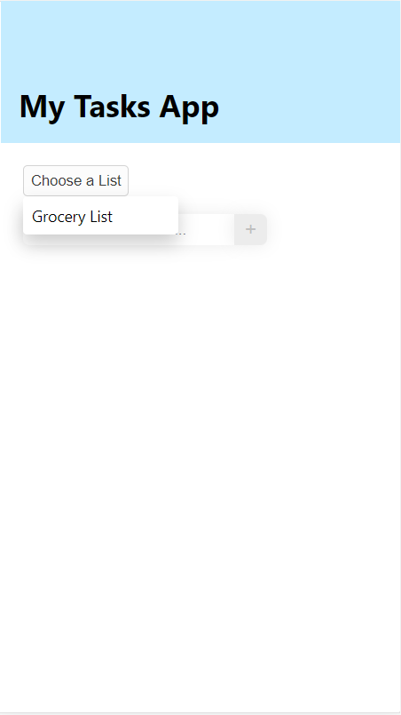
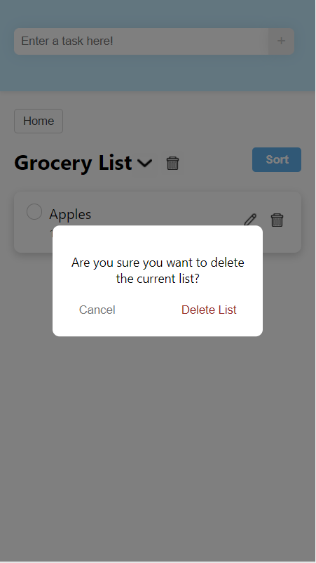
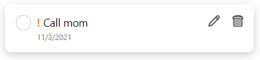
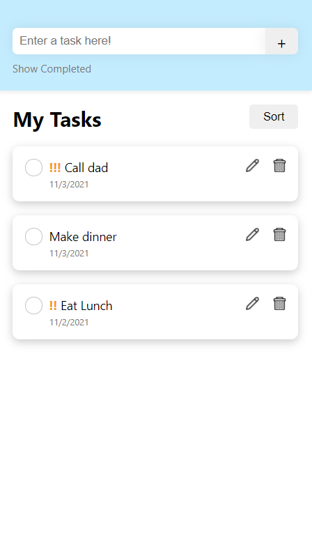
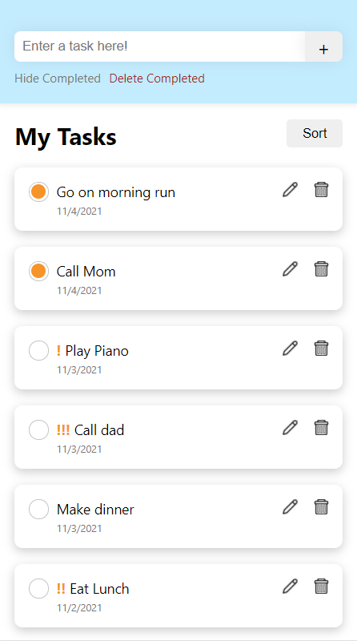
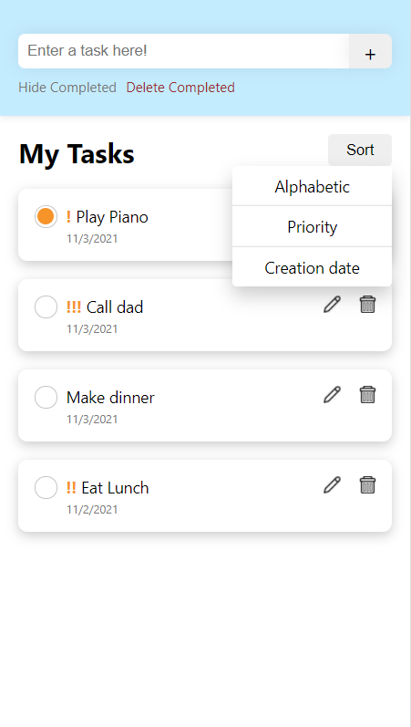
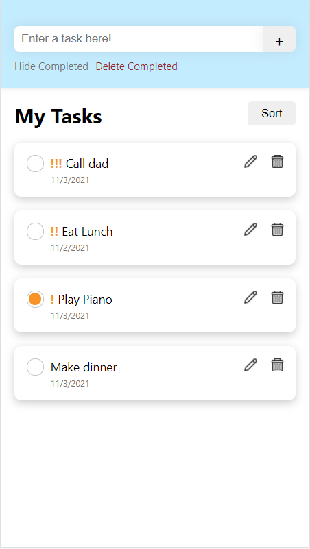

design.md# CS124 Lab4 Design Document

## Design Decisions
Our previous Lab 4 Design Document can be found [here](https://github.com/McGarvs/cs124/blob/lab4/docs/design.md).
To recap, our final design from Lab 5 can be compared to the final design of Lab 4 in the three tables below:

New Lab 5 Design - Home Page | New Lab 5 Design - Tasks Page
---------------------------- | -----------------------------
 | 

New Lab 5 Design - Home Page | New Lab 5 Design - Tasks Page
---------------------------- | -----------------------------
 | 

Old Lab 4 Design - Home Page | Old Lab 4 Design - Tasks Page
---------------------------- | -----------------------------
 | 

The key differences are as follows:
* Sign in / Log in Functionality:
  * Users can create an account on the sign up tab
  * Each user has access to creating and editing their own unique lists
  * The user can log in and log out at any time
  * The user can send an email to themselves verify their account
* List Sharing Functionality: 
  * Lists can be shared between users, which lists are shared is noted in the home page
  * The list details page shows the owner of a list
  * The owner of a list can manage who has access to their list (anyone with access can edit but not delete the list)
  * Persons who were shared a list can remove themselves from the list.
* Style/Accessibility Changes:
  * Button colors were made darker to increase contrast
  * Buttons styling and colors were made more uniform
  * Priority color was changed from a bright-orange to a dark-red to increase visibility and contrast.
  * The home page no longer has a dropdown, instead lists are displayed automatically as a list.
  * The home page displays if a list is not owned by the user, and if it is being shared.

## Alternative Designs
We mostly focused on improvements in this lab, and did not come up with many designs alternative to our current one.
Some design alternatives included simply in choosing which button styles to make more uniform, and which
colors to choose for our style/accessibility refactoring. 

## User Testing

## Final Design
Our final design from this lab, can be seen in the tables above. 
We will now walk through each of the supported features. Note that some screenshots may be outdated.

### Multi-User Features
These are the new features that have been added to support multi-user functionality.

#### Signing up
The user loads the app, and sees a sign-up tab. 

The user goes to the sign-up tab and enters in their info and a bad password.

The user sees the error message, and tries a new stronger password.

The user sees a quick loading message (no screenshot), and are taken to their new homepage.

The user clicks Logout, and they are brought back to the initial page.

### List-Sharing Features
These are the new features that have been added to support list sharing functionality.

#### Manage a shared List
The user is at their homepage and sees that they have some shared lists. They click Test List.

The user is at the list details page and sees that they own the list.

The user is at the list details page and clicks the share button.

The user is at the list details page and enters an email into the form.

The user sees their newly added email listed..

The user tries to delete some emails from the shared list.

#### Look at shared List

The user is at their homepage and sees that they have some shared lists. They click Dylan's List.

The user sees that they do not own the list.

The user clicks share and sees that they can remove themselves from the list.

## Outdated Images

### Multi-List Features
These are the new features that have been added to support multi-list functionality.

#### Adding a New List
The user is at the Home Page, and sees that there are no lists.

The user is at the Home Page, and types in a new list name in the field.

The user hits the plus button next to the form, and then goes into the dropdown to see their list.

The user clicks their list in the dropdown, and are taken to the list display page, with no current tasks.

#### Deleting the Current List
The user is at the display page for a list.

The user clicks the trashcan icon by the list's name, and brings up a modal.

The user clicks to confirm delete on the modal. They are brought to the home page, 
and they see that the list no longer exists.

#### Selecting a Different List
If the user is at the Home Page, they click the "Choose a List" button. 
From the dropdown, they click "Dylan's List".

The user is brought to the list page for "Dylan's List".

The user is at "Dylan's List" and they click the arrow next to the list header. 
From the dropdown, they click "Grocery List".

The user is brought to the list page for "Grocery List".

### List-Specific Features
Since our List specific features have largely remained the same, we will re-use the pictures from lab 3.
The only visual difference between these photos and lab4 is the following:
* "My Tasks" header has been renamed to dynamically display the list name
* An arrow icon button that displays a dropdown to switch between lists
* A "Home" button that takes the user to the initial page

#### Marking a task as completed/not completed
The user has a list of tasks -- some are completed, some are not.

The user clicks on the open circle within a task to mark it as completed.

#### Adding a new task
To add a new task, the user types in text for the new task in the header.

After finishing typing in text, the user clicks the "+", or add, button to add
this new task to the list of tasks.

The new task appears at the top of the list, uncompleted with no priority by default.

#### Editing a task
The user has a list of tasks and wants to rename and re-prioritize the second.
The user clicks on the button with the edit icon.

The user is autofocused on a text box where the original task name is the starting value.

The task text is edited to be something different, and the user selects a new priority level.
The user then clicks on "Save" to save changes.

After clicking save, the renamed task is displayed with a new priority level.

#### Deleting a task
The user has a list of tasks and wants to delete the first one. The user clicks on the trash
can icon.

A modal is displayed that asks the user to confirm or cancel their delete request. If cancel
is clicked, the modal will close with no changes to the list of tasks. However, the user does
want to delete and confirms this by clicking "Delete".

After the delete request is confirmed, the modal closes and the first task is removed from the
list of tasks.

#### Hiding completed tasks
By default, the list of tasks displays all tasks, completed or not.

The user clicks on the button "Hide Completed" to hide all completed tasks. In this state, the
"Delete Completed" button is hidden because there are no complete tasks displayed.

#### Deleting all completed tasks
The user clicks on "Deleted Completed" button to delete all completed tasks.

A modal pops up asking the user to confirm the request to delete all completed tasks.

After the user confirms this "Delete Completed" request, the modal closes and all completed
tasks are deleted. Since there are no longer any completed tasks in this view, the "Hide Completed"
and "Delete Completed" buttons are hidden from view.

#### Changing the task display order
The user sees the sort button and decides to click it, bringing up the drop-down menu.

The user sees that they can sort by alphabetic, priority, and creation date.
They decide to click sort by priority, and then see the tasks reordered, with higher priorities
higher up on the list.

## Challenges + Reflections
Similarly to our previous lab, our project has seen a lot of bloating, and refactoring continued to be a challenge. One
refactor we are particularly proud of is having made our css more modular, with several reused styles being put into a
constants.css. In particular, we are pleased with our login, having implemented a simple email and password login, but also a google
sign-in as well. Sadly this time around, we didn't get to do a round of user testing, which would have been nice to test some of our 
new features.