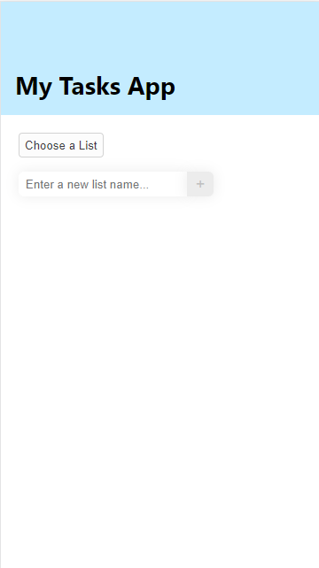
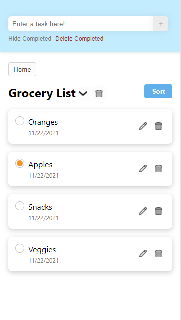

# CS124 Lab4 Design Document

## Design Decisions
Our previous Lab 3 Design Document can be found [here](https://github.com/McGarvs/cs124/blob/lab3/docs/design.md).
To recap, our final design from Lab 4 can be compared to the final design of Lab 3 in the table below:

Lab 3 Design  | Lab 4 Design - Home Page | Lab 4 Design - Tasks Page
------------- | ------------------------ | ---------------------------
 |  | 

The key differences are as follows:
* Dynamic Resizing based on the device's screen size
* Multiple List Functionality: 
  * New Page displayed on first load of the web app, allows list creation and selection
  * On the List Display Page, the header was changed from "My Tasks" to the list's name
  * The List Display Page allows selection of different lists, and deletion of the current list
* Accessibility Features:
  * Can now use tab and enter on the custom dropdowns for sort and list selection
  * Improved usability with screen reader
  * App displays better upon zooming up to 200%

## Alternative Designs

## User Testing

## Final Design

## Challenges + Reflections