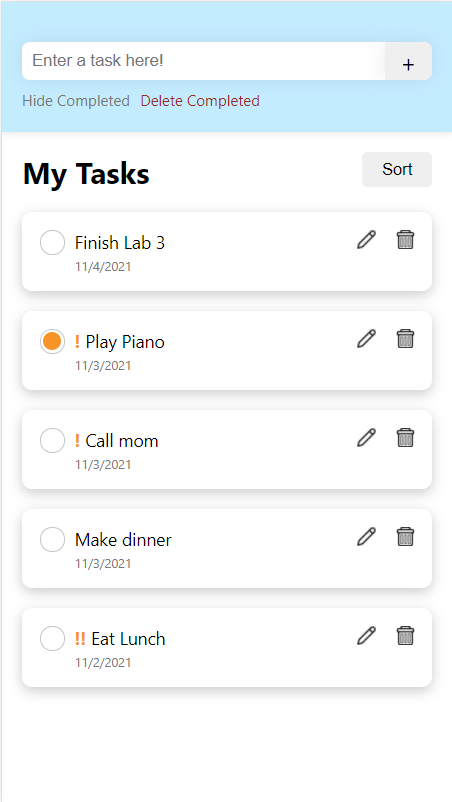

# CS124 Lab4 Design Document

## Design Decisions
Our previous Lab 3 Design Document can be found [here](https://github.com/McGarvs/cs124/blob/lab3/docs/design.md).
To recap, our final design from Lab 4 can be compared to the final design of Lab 3 in the table below:

Lab 3 Design  | Lab 4 Design - Home Page | Lab 4 Design - Tasks Page
------------- | ------------------------ | ---------------------------
 |  | 

The key differences are as follows:
* Dynamic Resizing based on the device's screen size
* Multiple List Functionality: 
  * New Page displayed on first load of the web app, allows list creation and selection
  * On the List Display Page, the header was changed from "My Tasks" to the list's name
  * The List Display Page allows selection of different lists, and deletion of the current list
* Accessibility Features:
  * Can now use tab and enter on the custom dropdowns for sort and list selection
  * Improved usability with screen reader
  * App displays better upon zooming up to 200%

## Alternative Designs

## User Testing

## Final Design
Our final design from this lab looks like this:

Lab 4 Design - Home Page | Lab 4 Design - Tasks Page
------------------------ | ---------------------------
 | 

We will now walk through each of the supported features.

### Multi-List Features
These are the new features that have been added to support multi-list functionality.

#### Adding a New List
The user is at the Home Page, and sees that there are no lists.

The user is at the Home Page, and types in a new list name in the field.

The user hits the plus button next to the form, and then goes into the dropdown to see their list.

The user clicks their list in the dropdown, and are taken to the list display page, with no current tasks.

#### Deleting the Current List
The user is at the display page for a list.

The user clicks the trashcan icon by the list's name, and brings up a modal.

The user clicks to confirm delete on the modal. They are brought to the home page, 
and they see that the list no longer exists.

#### Selecting a Different List
If the user is at the Home Page, they click the "Choose a List" button.

If the user is at a List Display Page, they click 

### List-Specific Features
Since our List specific features have largely remained the same, we will re-use the pictures from lab 3.
The only visual difference between these photos and lab4 is the following:
* "My Tasks" header has been renamed to dynamically display the list name
* An arrow icon button that displays a dropdown to switch between lists
* A "Home" button that takes the user to the initial page

#### Marking a task as completed/not completed
The user has a list of tasks -- some are completed, some are not.

The user clicks on the open circle within a task to mark it as completed.

#### Adding a new task
To add a new task, the user types in text for the new task in the header.

After finishing typing in text, the user clicks the "+", or add, button to add
this new task to the list of tasks.

The new task appears at the top of the list, uncompleted with no priority by default.

#### Editing a task
The user has a list of tasks and wants to rename and re-prioritize the second.
The user clicks on the button with the edit icon.

The user is autofocused on a text box where the original task name is the starting value.

The task text is edited to be something different, and the user selects a new priority level.
The user then clicks on "Save" to save changes.

After clicking save, the renamed task is displayed with a new priority level.

#### Deleting a task
The user has a list of tasks and wants to delete the first one. The user clicks on the trash
can icon.

A modal is displayed that asks the user to confirm or cancel their delete request. If cancel
is clicked, the modal will close with no changes to the list of tasks. However, the user does
want to delete and confirms this by clicking "Delete".

After the delete request is confirmed, the modal closes and the first task is removed from the
list of tasks.

#### Hiding completed tasks
By default, the list of tasks displays all tasks, completed or not.

The user clicks on the button "Hide Completed" to hide all completed tasks. In this state, the
"Delete Completed" button is hidden because there are no complete tasks displayed.

#### Deleting all completed tasks
The user clicks on "Deleted Completed" button to delete all completed tasks.

A modal pops up asking the user to confirm the request to delete all completed tasks.

After the user confirms this "Delete Completed" request, the modal closes and all completed
tasks are deleted. Since there are no longer any completed tasks in this view, the "Hide Completed"
and "Delete Completed" buttons are hidden from view.

#### Changing the task display order
The user sees the sort button and decides to click it, bringing up the drop-down menu.

The user sees that they can sort by alphabetic, priority, and creation date.
They decide to click sort by priority, and then see the tasks reordered, with higher priorities
higher up on the list.

## Challenges + Reflections