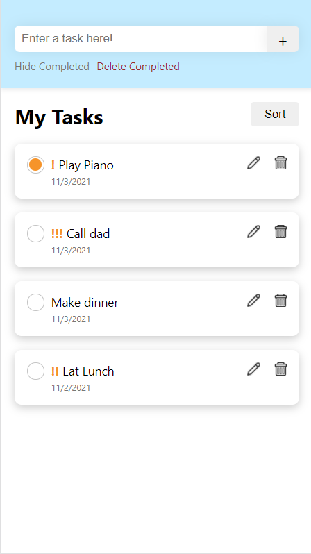

# CS124 Lab3 Design Document

## Design Decisions
Our Lab 3 Design Document can be found [here](https://github.com/McGarvs/cs124/blob/lab2/docs/design.md).
To recap, our final design from Lab 2 can be compared to the final design of Lab 3 in the table below:

Lab 2 Design                   | Lab 3 Design
------------------------------ | ---------------------------- 
 | 

The key differences are as follows:
* Different Header Color: Changed from light yellow to light blue, it is a calmer color, 
and we think it fits our aesthetic better.
* Changed what was displayed in the header and its order to be clearer: The title is now below
and aligned with the sort button, while the "Completed" Buttons were moved below the add task field.
* Creating a Task automatically stores creation date, which is now displayed.
* Each task has a modifiable priority, denoted by exclamation points!
* Added a Sort button to sort: Alphabetically, by Creation Date, and by Priority.
* Changed Green Check Icon to Orange Circle (similar to lab 1) to be more crisp, and to match the
  color scheme for the priority exclamation points.
## Alternative Designs
We 

## User Testing
TODO
## Final Design
Our final design from this lab looks like this:

We will now walk through each of the supported features.

### Marking a task as completed/not completed
The user has a list of tasks -- some are completed, some are not.

The user clicks on the open circle within a task to mark it as completed.

### Adding a new task
To add a new task, the user types in text for the new task in the header.

After finishing typing in text, the user clicks the "+", or add, button to add
this new task to the list of tasks.

The new task appears at the top of the list, uncompleted by default.

### Editing a task
The user has a list of tasks and wants to rename and re-prioritize the second. 
The user clicks on the button with the edit icon.

The user is autofocused on a text box where the original task name is the starting value.

The task text is edited to be something different, and the user selects a new priority level.
The user then clicks on "Save" to save changes.

After clicking save, the renamed task is what's displayed, along with a new priority level.

### Deleting a task
The user has a list of tasks and wants to delete the first one. The user clicks on the trash
can icon.

A modal is displayed that asks the user to confirm or cancel their delete request. If cancel
is clicked, the modal will close with no changes to the list of tasks. However, the user does
want to delete and confirms this by clicking "Delete".

After the delete request is confirmed, the modal closes and the first task is removed from the
list of tasks.

### Hiding completed tasks
By default, the list of tasks displays all tasks, completed or not.

The user clicks on the button "Hide Completed" to hide all completed tasks. In this state, the
"Delete Completed" button is hidden because there are no complete tasks displayed.

### Deleting all completed tasks
The user clicks on "Deleted Completed" button to delete all completed tasks.

A modal pops up asking the user to confirm the request to delete all completed tasks.

After the user confirms this "Delete Completed" request, the modal closes and all completed
tasks are deleted. Since there are no longer any completed tasks in this view, the "Hide Completed"
and "Delete Completed" buttons are hidden from view.

## Challenges + Reflections
Deciding
